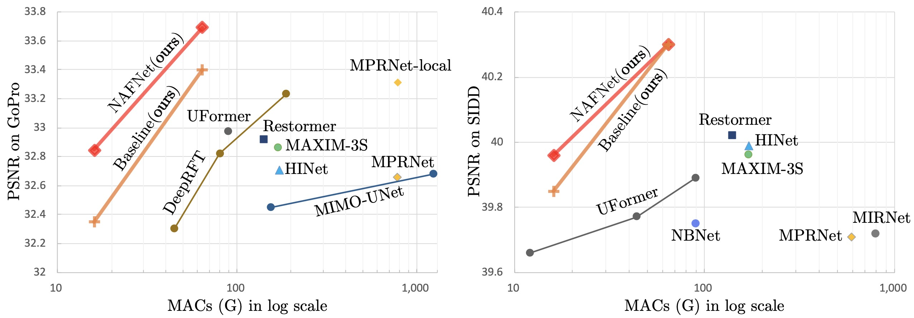

## NAFNet: Nonlinear Activation Free Network for Image Restoration


The official pytorch implementation of the paper **Simple Baselines for Image Restoration**

#### Liangyu Chen\*, Xiaojie Chu\*, Xiangyu Zhang, Jian Sun

>Although there have been significant advances in the field of image restoration recently, the system complexity of the state-of-the-art (SOTA) methods is increasing as well, which may hinder the convenient analysis and comparison of methods. 
>In this paper, we propose a simple baseline that exceeds the SOTA methods and is computationally efficient. 
>To further simplify the baseline, we reveal that the nonlinear activation functions, e.g. Sigmoid, ReLU, GELU, Softmax, etc. are **not necessary**: they could be replaced by multiplication or removed. Thus, we derive a Nonlinear Activation Free Network, namely NAFNet, from the baseline. SOTA results are achieved on various challenging benchmarks, e.g. 33.69 dB PSNR on GoPro (for image deblurring), exceeding the previous SOTA 0.38 dB with only 8.4% of its computational costs; 40.30 dB PSNR on SIDD (for image denoising), exceeding the previous SOTA 0.28 dB with less than half of its computational costs.



### News
NAFNet based Stereo Image Super-Resolution solution won the **1st place** on the NTIRE 2022 Stereo Image Super-resolution Challenge! Coming Soon.

### Installation
This implementation based on [BasicSR](https://github.com/xinntao/BasicSR) which is a open source toolbox for image/video restoration tasks and [HINet](https://github.com/megvii-model/HINet) 

```python
python 3.9.5
pytorch 1.11.0
cuda 11.3
```

```
git clone https://github.com/megvii-research/NAFNet
cd NAFNet
pip install -r requirements.txt
python setup.py develop --no_cuda_ext
```

### Quick Start 
* Image Denoise Demo: [<a href="https://colab.research.google.com/drive/1dkO5AyktmBoWwxBwoKFUurIDn0m4qDXT?usp=sharing"></a>](https://colab.research.google.com/drive/1dkO5AyktmBoWwxBwoKFUurIDn0m4qDXT?usp=sharing)
* Image Deblur Demo: [<a href="https://colab.research.google.com/drive/1yR2ClVuMefisH12d_srXMhHnHwwA1YmU?usp=sharing"></a>](https://colab.research.google.com/drive/1yR2ClVuMefisH12d_srXMhHnHwwA1YmU?usp=sharing)


### Image Restoration Tasks
---

<details><summary>Image Denoise - SIDD dataset (Click to expand) </summary>

* prepare data

  * ```mkdir ./datasets/SIDD ```
  
  * download the SIDD-Medium sRGB Dataset in [here](https://www.eecs.yorku.ca/~kamel/sidd/dataset.php) and unzip it. Move Data (./SIDD_Medium_Srgb/Data) set to ./datasets/SIDD/ or make a soft link. Download [val](https://www.eecs.yorku.ca/~kamel/sidd/benchmark.php) files (ValidationNoisyBlocksSrgb.mat and ValidationGtBlocksSrgb.mat) in ./datasets/SIDD/ .
  * it should be like:
  
    ```bash
    ./datasets/SIDD/Data
    ./datasets/SIDD/ValidationNoisyBlocksSrgb.mat
    ./datasets/SIDD/ValidationGtBlocksSrgb.mat
    ```
  
  * ```python scripts/data_preparation/sidd.py```
    * crop the train image pairs to 512x512 patches


* eval
  * download [pretrained model](https://drive.google.com/file/d/14Fht1QQJ2gMlk4N1ERCRuElg8JfjrWWR/view) to ./experiments/pretrained_models/NAFNet-SIDD-width64.pth 
  * ```python -m torch.distributed.launch --nproc_per_node=8 --master_port=4321 basicsr/test.py -opt options/test/SIDD/NAFNet-width64.yml --launcher pytorch ```
    * distributed evaluation. Set nproc_per_node to 1 for single gpu evaluation.
    * ```calc_psnr(pred, gt)``` rather than ```calc_psnr(pred.round(), gt)``` to avoid the PSNR loss caused by the "round()" operation, following HINet, MPRNet, and etc.
  
* train
  * ```python -m torch.distributed.launch --nproc_per_node=8 --master_port=4321 basicsr/train.py -opt options/train/SIDD/NAFNet-width64.yml --launcher pytorch```

</details>

<details>
  <summary>Image Deblur - GoPro dataset (Click to expand) </summary>

* prepare data

  * ```mkdir ./datasets/GoPro ```
  
  * download the [train](https://drive.google.com/drive/folders/1AsgIP9_X0bg0olu2-1N6karm2x15cJWE) set to ./datasets/GoPro/train and [test](https://drive.google.com/drive/folders/1a2qKfXWpNuTGOm2-Jex8kfNSzYJLbqkf) set to ./datasets/GoPro/test (refer to [MPRNet](https://github.com/swz30/MPRNet)) 
  * it should be like:
  
    ```bash
    ./datasets/
    ./datasets/GoPro/
    ./datasets/GoPro/train/
    ./datasets/GoPro/train/input/
    ./datasets/GoPro/train/target/
    ./datasets/GoPro/test/
    ./datasets/GoPro/test/input/
    ./datasets/GoPro/test/target/
    ```
  
  * ```python scripts/data_preparation/gopro.py```
    * crop the train image pairs to 512x512 patches.


* eval
  * download [pretrained model](https://drive.google.com/file/d/1S0PVRbyTakYY9a82kujgZLbMihfNBLfC/view?usp=sharing) to ./experiments/pretrained_models/NAFNet-GoPro-width64.pth
  * ```python -m torch.distributed.launch --nproc_per_node=8 --master_port=4321 basicsr/test.py -opt options/test/GoPro/NAFNet-width64.yml --launcher pytorch```
      * distributed evaluation. Set nproc_per_node to 1 for single gpu evaluation.
  
* train
  * ```python -m torch.distributed.launch --nproc_per_node=8 --master_port=4321 basicsr/train.py -opt options/train/GoPro/NAFNet-width64.yml --launcher pytorch```

</details>

### Citations
If NAFNet helps your research or work, please consider citing NAFNet.

```
@article{chennafnet,
  title={Simple Baselines for Image Restoration},
  author={Chen, Liangyu and Chu, Xiaojie and Zhang, Xiangyu and Sun, Jian},
  journal={In preparation},
  year={2022}
}
```

### Contact

If you have any questions, please contact chenliangyu@megvii.com or chuxiaojie@megvii.com
